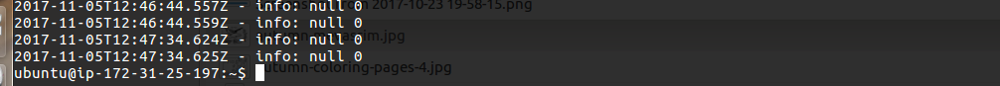
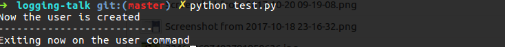
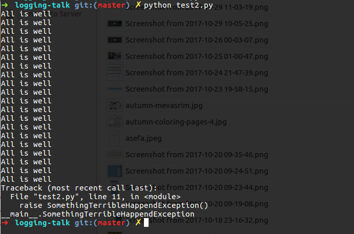

class: center, middle

# Logging.

[live presentation](https://alonisser.github.io/logging) <br/>
[twitter](alonisser@twitter.com), [medium](https://medium.com/@alonisser/)

#####Shameless promotion: you can also read my political blog: [דגל אדום](degeladom@wordpress.com)
---

# A really bad day

You know the drill, starting the morning with "IT'S NOT WORKING"
 
--

Oh, I'll take a look at the logs


--

Oh, no

---

# Three questions

* WHAT? WHEN? WHERE?

---

# The "visibility package"

* Logging is part of our app "visibility package" helping us to answer questions about: WHAT?! WHEN? WHERE?

* A good visibility package would include also include monitoring (APM and infrastructure), Error reporting and more.

---

# Three questions

* We can look at the common formatter as a pattern for answering this kind of questions

-- 


```python
formatter = "%(asctime)s:%(name)s:%(levelname)s:%(message)s"

```

---
# Shitty logs

.img-container[]

--

* No real info here. So null null null null

---

# Shitty logs

.img-container[]

--

* When did that actually happen? now? a year ago?


---

# Shitty logs

.img-container[]

--

* Context? What are the variables. what are did we try to do?

---

class: center, middle

# (Best) Practices

---

# Streams!

* Following the [12 factor app manifesto - logs chapter](https://12factor.net/logs), logs should be streams

* Allowing the container (supervisor/PASS platform/docker platform/etc) to handle logging streams

* Bad practice: Wiring logging handlers inside your app, such as file logging, logging to logstash etc.

---

# Stay on the same page

* STDERR only logging considered harmful


---

# Wrap them

---

# Metadata


---

# Filter them
* Handling sensitive data

---


# Know your readers

* Decision: machine readable vs human readable

--

.img-half-container[]


---

# Aggregate them

---

# Logging != Auditing

* But can be used as part of an auditing solution


---

class: center, middle

# Python logging

* logging module

* logger (who log with a level)
logger.info('hello world')
--
* formatters (who control formatting)

--
* filters (Who.. suprise! filter log messaages)
 
--
handlers, who loggers use and tie them together with formatters and optional filters together and to a specific output  

---

# Python logging: loggers

* Loggers have names: 
```python

logger = logging.getLogger('foo')
```
* loggers are hierarchical: foo.baz is a child of foo logger
* Loggers have attached handlers.. can be many (file, logstash, stderr, stdout) 
* Loggers can propogate logs to higher level loggers (or not)
* All loggers are children of root

--

Aren't we all children of root?

---

# Python logging: loggers
* Best practice for apps is using the module path as logger name
 
 ```python
 logger = logging.getLogger(__name__)
 
 ```
 --
 * For libs, or in a case you want a package to report as one, you'll set the logger name
 
 ```python
 logger = logging.getLogger('requests2')
 ```
 
 * So apps using the lib, just see the lib logger and not implementation details 

---
# Python logging: configuration example

* I won't get much into this since you can read the tutorial.  I usually prefer the dict config
```python
{
        'version': 1,
        'formatters': {
            'default': {
                'format': "%(asctime)s:%(name)s:%(levelname)s:%(message)s"
            }
        },
        'handlers': {

            'console': {
                'level': 'INFO',
                'class': 'logging.StreamHandler',
                'formatter': 'default',
                'stream': sys.stdout
            },
            'console_err': {
                'level': 'WARNING',
                'class': 'logging.StreamHandler',
                'formatter': 'default',
                'stream': sys.stderr
            }
        },
        'loggers': {

            '': {
                'handlers': LOGGING_HANDLERS,
                'level': 'INFO',
                'propagate': True,
            }, 'django': {
                'handlers': LOGGING_HANDLERS,
                'level': 'INFO',
                'propagate': False,
            },
            'django.request': {
                'handlers': LOGGING_HANDLERS,
                'level': 'WARNING',
                'propagate': False,
            
            'requests': {
                'level': 'INFO',
                'handlers': LOGGING_HANDLERS,
                'propagate': False,
            }
        },
    }

```

---
# What (exception handling)

---

# Read some more

* [python logging tutorial](https://docs.python.org/3.6/howto/logging.html) 

* [12 factor app manifesto - logs chapter](https://12factor.net/logs)

---

class: center, middle

#Open source rocks!

---

class: center, middle

#Thanks for listening!

---
